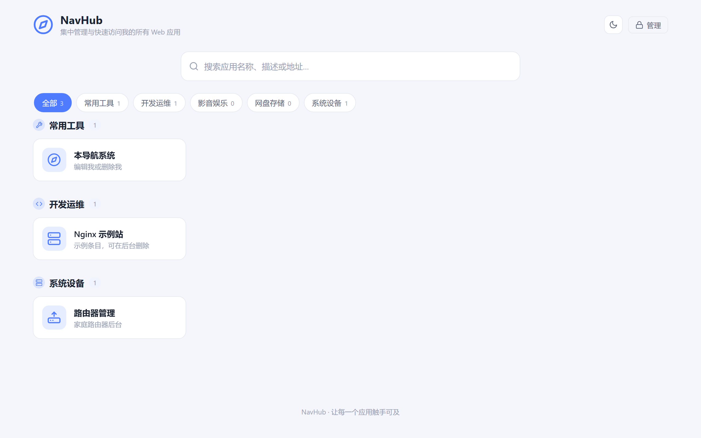
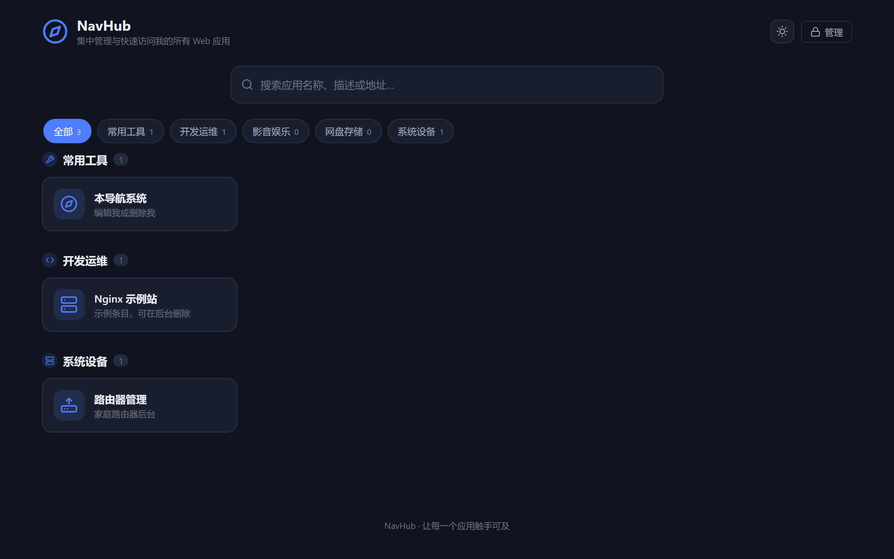

<div align="center">

# NavHub (Rust)

**自托管 Web 应用导航站 —— Rust + Axum 极致轻量实现**

单文件二进制 · 3.5 MB · 空闲内存约 7 MB · 零运行时依赖 · 为 ARM64 / Armbian / 家庭服务器而生

[](https://www.rust-lang.org/)
[](https://github.com/tokio-rs/axum)
[](https://www.sqlite.org/)
[](#-安装部署)
[](https://github.com/tanglx02/navhub-rs/releases)
[](#-二次开发)
[](LICENSE)

</div>

---

NavHub (Rust) 是 [NavHub](https://github.com/tanglx02/navhub)（FastAPI 版）的 Rust 重写。功能与体验 1:1 对齐，但把资源占用做到极致：**约 3.5 MB 的单个可执行文件内嵌全部后端与前端产物**，在 4GB 内存的 Armbian 设备上 7×24 小时运行时，常驻内存仅约 7 MB（Python 版约 100 MB+）。

## 界面预览

<p align="center">
  
</p>

<table align="center">
  <tr>
    <td align="center"></td>
    <td align="center"></td>
  </tr>
  <tr>
    <td align="center"><b>深色模式</b></td>
    <td align="center"><b>移动端自适应</b></td>
  </tr>
</table>

## 功能特点

- **应用导航**：卡片式展示常用 Web 应用，支持搜索、分类分组、排序、启停用
- **分类管理**：增删改分类，删除分类时应用自动归为未分类（级联安全）
- **图标体系**：内置图标库 + 颜色自定义 + 上传图片图标（魔数校验防伪造）
- **管理后台**：JWT 登录认证、修改密码、登录失败限速锁定（防爆破）
- **站点设置**：站点名称、副标题在线修改，即时生效
- **SPA 前端**：Vue 3 构建产物内嵌托管，历史路由回退完整支持
- **安全默认**：bcrypt(cost=12) 口令哈希、参数化 SQL、CSP 友好安全响应头、上传目录防穿越
- **极致轻量**：单二进制 3.5 MB，空闲内存 ~7 MB，冷启动毫秒级，SQLite 单文件存储
- **零依赖部署**：无需 Docker / Python / Node，复制即用；systemd 一键托管

## 技术栈

| 层 | 选型 | 说明 |
|---|---|---|
| 后端 | Rust + [Axum 0.8](https://github.com/tokio-rs/axum) | tokio 异步运行时，release 优化 `lto + strip` |
| 数据库 | SQLite（[rusqlite](https://github.com/rusqlite/rusqlite) bundled） | 内嵌编译，无需系统库；WAL 模式 |
| 认证 | jsonwebtoken + bcrypt | JWT HS256，口令 cost=12 |
| 前端 | Vue 3 + Vite（构建产物随仓库分发） | 源码见 [navhub 仓库](https://github.com/tanglx02/navhub) |
| 静态托管 | tower-http ServeDir/ServeFile | SPA 回退 + 安全响应头 |
| 配置 | 环境变量 / `.env`（dotenvy） | 与 Python 版变量名兼容 |

## 系统要求

| 平台 | 架构 | 说明 |
|---|---|---|
| Linux / Armbian | x86_64 / **ARM64 (aarch64)** | 推荐 512MB 内存以上即可 |
| Windows | x86_64 | Win10/11，免安装 exe 直接运行 |
| macOS | Apple Silicon / Intel | 源码构建 |

## 下载（预编译包）

每个 [Releases](https://github.com/tanglx02/navhub-rs/releases) 附件都是一个**自包含运行目录**：压缩包内是一层 `navhub/`，含可执行文件、`frontend/dist`、`.env.example`、`scripts/navhub.service` 与文档。解压即可运行，无需安装 Rust、Node 或任何运行时。

| 文件 | 平台 | 说明 |
|---|---|---|
| `navhub-X.Y.Z-linux-arm64.tar.gz` | Linux aarch64 | Armbian / 树莓派 4-5 / 香橙派（glibc ≥ 2.28） |
| `navhub-X.Y.Z-linux-amd64.tar.gz` | Linux x86_64 | 通用服务器 / PC（glibc ≥ 2.28） |
| `navhub-X.Y.Z-windows-amd64.tar.gz` | Windows x64 | Win10/11 免安装 |
| `navhub-X.Y.Z-macos-arm64.tar.gz` | macOS Apple Silicon | M1/M2/M3/M4 |
| `navhub-X.Y.Z-macos-amd64.tar.gz` | macOS Intel | |
| `navhub-X.Y.Z-SHA256SUMS.txt` | — | 全部制品校验和 |

校验示例：`sha256sum -c navhub-X.Y.Z-SHA256SUMS.txt`（X.Y.Z 为版本号，如 `1.0.0`）

多平台制品由 GitHub Actions 自动构建（工作流：[.github/workflows/release.yml](.github/workflows/release.yml)，推送 `v*` 标签触发；Linux 使用 `cargo-zigbuild` 锁定 glibc 2.28 以保证 ARM64 设备兼容）。

## 安装部署

### Windows

```powershell
# 1. 下载 Releases 中的 navhub-*-windows-amd64.tar.gz，解压到任意目录（tar 为 Win10+ 自带）
tar -xzf navhub-1.0.0-windows-amd64.tar.gz
# 2. 目录结构：
#    .\navhub\navhub.exe
#    .\navhub\frontend\dist\   （前端产物，必须与 exe 同根）
# 3. 启动
cd navhub
.\navhub.exe
# 浏览器打开 http://localhost:8100
```

后台常驻可注册为计划任务或服务（如 [NSSM](https://nssm.cc/)）：`nssm install navhub D:\navhub\navhub.exe`

### Linux / Armbian（ARM64）

方式一：下载预编译包（推荐，ARM64 设备免编译）

```bash
# 1. 下载 navhub-*-linux-arm64.tar.gz 后解压到 /opt（包内即 navhub/ 目录）
sudo tar -xzf navhub-1.0.0-linux-arm64.tar.gz -C /opt
# 结果：/opt/navhub/navhub + /opt/navhub/frontend/dist/

# 2. 建立运行用户并授权
sudo useradd -r -s /usr/sbin/nologin navhub || true
sudo chown -R navhub:navhub /opt/navhub

# 3. 前台试运行
cd /opt/navhub && sudo -u navhub ./navhub
# 浏览器打开 http://<设备IP>:8100
```

> 二进制以 glibc 2.28 为下限构建（Debian 10 / Armbian 21.x 及更新版本均可运行）。若设备更古老，请用下方源码构建。

方式二：源码构建

```bash
# 1. 安装 Rust 工具链（一次性）
curl --proto '=https' --tlsv1.2 -sSf https://sh.rustup.rs | sh
source "$HOME/.cargo/env"

# 2. 获取代码
git clone https://github.com/tanglx02/navhub-rs.git
cd navhub-rs

# 3. 编译（约 3~8 分钟，视设备性能）
cargo build --release

# 4. 部署到 /opt/navhub（二进制 + 前端产物同根）
sudo mkdir -p /opt/navhub/frontend
sudo cp target/release/navhub /opt/navhub/
sudo cp -r frontend/dist /opt/navhub/frontend/
sudo useradd -r -s /usr/sbin/nologin navhub || true
sudo chown -R navhub:navhub /opt/navhub

# 5. 前台试运行
sudo -u navhub /opt/navhub/navhub
# 浏览器打开 http://<设备IP>:8100
```

### macOS

```bash
# 预编译包（压缩包内为 navhub/ 运行目录）
tar -xzf navhub-1.0.0-macos-arm64.tar.gz    # Apple Silicon；Intel 用 macos-amd64
cd navhub && xattr -d com.apple.quarantine ./navhub 2>/dev/null; ./navhub
# 打开 http://localhost:8100

# 或源码构建
brew install rust
git clone https://github.com/tanglx02/navhub-rs.git
cd navhub-rs
cargo build --release
./target/release/navhub
```

### systemd 常驻服务（Linux / Armbian）

```bash
sudo cp scripts/navhub.service /etc/systemd/system/
sudo systemctl daemon-reload
sudo systemctl enable --now navhub
systemctl status navhub        # 查看状态
journalctl -u navhub -f        # 查看日志
```

服务单元已内置 `MemoryMax=128M` 与权限加固项，适合资源受限设备。

## 默认账号

| 用户名 | 密码 | 说明 |
|---|---|---|
| `admin` | `admin123` | 首次建库自动创建 |

> **首次登录须知**：请立即进入「管理后台 → 站点设置 / 修改密码」更换默认密码。初始凭据仅适用于内网试用，公网暴露前必须修改。也可通过环境变量 `ADMIN_USERNAME` / `ADMIN_PASSWORD` 在首次启动前指定。

## 配置说明

程序根目录由 `NAVHUB_BASE_DIR` 决定（默认取可执行文件所在目录），数据库、上传、密钥都生成在其下，无需手工建目录。支持根目录 `.env` 文件（参考 [.env.example](.env.example)）：

| 环境变量 | 默认值 | 说明 |
|---|---|---|
| `HOST` | `0.0.0.0` | 监听地址 |
| `PORT` | `8100` | 监听端口（与 Python 版 8000 区分，便于并行部署） |
| `DEBUG` | `false` | 调试日志 |
| `SECRET_KEY` | 自动生成 | JWT 密钥；缺省时生成并存于 `config/secret.key`（0600） |
| `TOKEN_EXPIRE_MINUTES` | `1440` | 登录令牌有效期（分钟） |
| `CORS_ORIGINS` | `*` | 跨域来源，逗号分隔；同源部署无需修改 |
| `LOGIN_MAX_FAILURES` | `5` | 同一 IP+账号 连续失败次数上限 |
| `LOGIN_LOCK_MINUTES` | `15` | 超限锁定时长（分钟） |
| `UPLOAD_MAX_MB` | `2` | 图标上传大小上限 |
| `DATA_DIR` | `<根>/database` | 数据目录（SQLite + 上传） |
| `ADMIN_USERNAME` / `ADMIN_PASSWORD` | `admin` / `admin123` | 初始管理员（仅首次建库生效） |

## 使用方法

1. 启动后访问 `http://<主机>:8100` —— 公开导航首页，支持搜索与分类过滤
2. 访问 `http://<主机>:8100/admin/login` —— 登录后进入管理后台
3. 「应用管理」添加/编辑应用（名称、URL、图标、颜色、所属分类、排序、启用）
4. 「分类管理」维护分类；「站点设置」修改站点名称与副标题

## 更新方法

```bash
cd navhub-rs
git pull
cargo build --release
sudo cp target/release/navhub /opt/navhub/navhub
sudo systemctl restart navhub
```

数据（`database/`、`config/`）与二进制分离，升级不丢数据。

## 备份与恢复

所有状态集中在程序根目录下，**冷备份即拷贝目录**：

```bash
# 备份（停不停服务均可，SQLite 处于 WAL 模式；停机备份最稳）
sudo systemctl stop navhub
tar czf navhub-backup-$(date +%F).tar.gz -C /opt/navhub database config .env
sudo systemctl start navhub

# 恢复
tar xzf navhub-backup-2026-09-22.tar.gz -C /opt/navhub
sudo chown -R navhub:navhub /opt/navhub && sudo systemctl restart navhub
```

需要备份的内容：`database/nav.db*`（数据）、`database/uploads/`（图标）、`config/secret.key`（JWT 密钥，丢失则全员重新登录）、`.env`（配置）。

## 常见问题

<details>
<summary>启动提示端口被占用</summary>

修改 `.env` 中 `PORT`，或释放占用：`ss -tlnp | grep 8100`（Linux）/ `netstat -ano | findstr 8100`（Windows）。

</details>

<details>
<summary>访问首页显示「前端尚未构建」</summary>

`frontend/dist` 必须与可执行文件同根（`NAVHUB_BASE_DIR` 之下）。源码构建时仓库自带产物；若自行移动 exe，请一并复制 `frontend/dist`。

</details>

<details>
<summary>忘记管理员密码</summary>

删除 `database/nav.db` 前请先备份，然后设置环境变量 `ADMIN_PASSWORD` 为新值并删除 `database/nav.db-wal`/`-shm`，重启后重建账号（会丢失数据，推荐从备份恢复后覆盖口令）。

</details>

<details>
<summary>ARM64 设备编译慢或内存不足</summary>

`cargo build --release` 峰值内存约 1GB。4GB 设备无压力；1GB 设备可加 swap 或先 `opt-level=1` 调试构建。也可在 PC 上交叉编译：`rustup target add aarch64-unknown-linux-gnu` 配合 `cargo build --release --target aarch64-unknown-linux-gnu`（需 aarch64-linux-gnu-gcc 工具链）。

</details>

<details>
<summary>登录提示 429 Too Many Requests</summary>

触发了登录限速（默认 5 次失败锁 15 分钟）。等待解锁或调整 `LOGIN_MAX_FAILURES` / `LOGIN_LOCK_MINUTES`。

</details>

## 项目结构

```
navhub-rs/
├── src/
│   ├── main.rs            # 启动入口（信号处理优雅退出）
│   ├── lib.rs             # 组件装配（供集成测试复用）
│   ├── config.rs          # 环境变量 / .env 配置加载
│   ├── db.rs              # SQLite 连接池、迁移与种子数据
│   ├── auth.rs            # JWT、bcrypt、登录限速、认证提取器
│   ├── errors.rs          # 统一 API 错误（对齐 FastAPI detail 格式）
│   ├── schemas.rs         # 请求校验（URL / 颜色正则）
│   ├── routes.rs          # 路由、CORS、安全头、SPA 回退
│   ├── state.rs           # 应用共享状态
│   └── handlers/          # auth / apps / categories / upload / settings / system
├── tests/api.rs           # 18 项集成测试（与 Python 版测试契约对齐）
├── frontend/dist/         # Vue 3 前端构建产物（源码见 navhub 仓库）
├── scripts/navhub.service # systemd 服务单元
├── docs/images/           # 截图
├── .env.example           # 配置示例
└── CHANGELOG.md
```

运行时生成（均被 `.gitignore` 排除）：`database/`（nav.db + uploads/）、`config/secret.key`。

## 二次开发

```bash
# 开发运行（热断言：默认端口 8100）
cargo run

# 集成测试（18 项，临时目录隔离，无需真实端口）
cargo test

# 发布构建（单文件 target/release/navhub，约 3.5 MB）
cargo build --release
```

- 前端源码（Vue 3）位于 [tanglx02/navhub](https://github.com/tanglx02/navhub) 的 `frontend/`，`npm run build` 后将 `dist/` 复制到本仓库 `frontend/dist` 即可。
- API 与 Python 版完全兼容（`/api/*` 契约、错误格式、鉴权头一致），前端无需任何改动。
- 代码风格：`cargo fmt` + `cargo clippy`。

## 与 Python 版对比

| 指标 | navhub (FastAPI) | navhub-rs (Axum) |
|---|---|---|
| 部署产物 | Python 源码 + venv 依赖 | **单文件 3.5 MB** |
| 空闲内存 | ~100 MB | **~7 MB** |
| 冷启动 | ~1 s | **< 0.1 s** |
| 运行时依赖 | Python 3 + pip 包 | 无（SQLite 内嵌） |
| 功能 | 基准 | 1:1 对齐（18 项集成测试验证） |

## License

[MIT](LICENSE) © 2026 tanglx02
